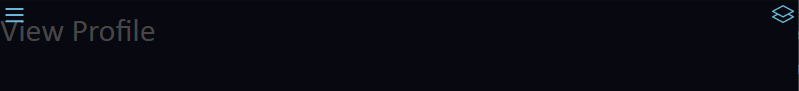

# Dashboard for react

### Introduction

You can wrap your React App. Put root `<App />` component (only 1 component) in `Content`.  
All dependencies are stored in `package.json`. Install manually or using `npm install`.  
Basic version supplied without global state, but `Dashboard` can be use with state manager: `redux`, `effector`, `mobx` etc.

### Installing

- ##### Using git clone
  Install package from [Github](https://github.com/Danzo0l/dashboard). Go to `source` directory of your project and run:  
  `git clone https://github.com/Danzo0l/dashboard.git`
- ##### Manual installation
  Install package from [here](https://github.com/Danzo0l/dashboard). Install package, extract it in `source` directory.

### Getting started

Install module and write base wrapper:

```tsx
root.render(
  <Dashboard>
    <Sidebar key={'sidebar'}>
      <Account />
      <AccountList />
    </Sidebar>
    <Content key={'content'}>
      <App />
    </Content>
    <Toolbar key={'toolbar'}>put your compnents</Toolbar>
  </Dashboard>
);
```

_You can delete something_: `Toolbar`, `Sidebar`.

- **⚠️** `Content` component - required, using as parent for `App`
- **⚠️** `Dashboard` - using as main component of dashboard

### Components

Use the recommended styles for the application component:

```css
.App {
  width: 100%;
  height: 100%;
  box-sizing: border-box;
}
```

Тote that the buttons to open the side menus may overlap the content. Therefore, add indents for informational or functional blocks.  


`Toolbar` and `Sidebar` has `children` props - you can create custom components and put it into component, for example:

```tsx
<Sidebar key={'sidebar'}>
  <Account />
  <AccountList />
  <CustomComponent />
  ...
</Sidebar>
```
